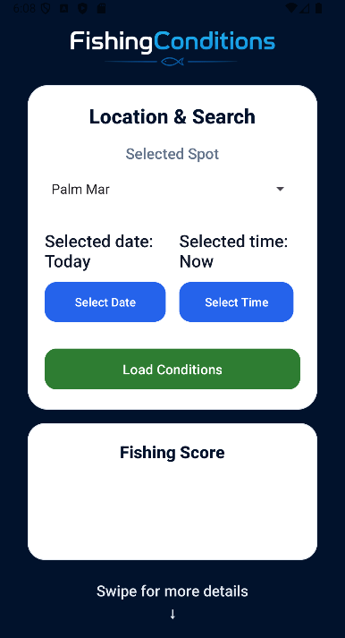
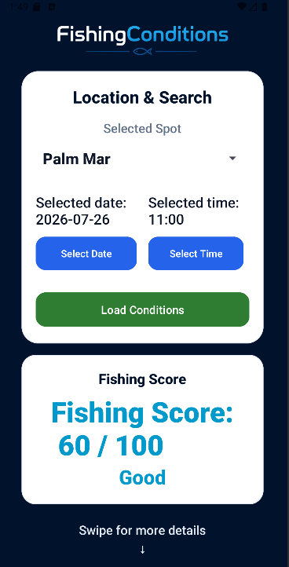
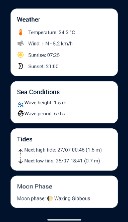

# FishingConditions

FishingConditions is an Android app built in Java to help users check whether a fishing session looks promising for a selected coastal spot in Tenerife. It combines weather, sea state, tides, moon phase, and a custom fishing score in a single screen.

I built it because, as a recreational fisherman, I had to check several different apps before planning a fishing session. With FishingConditions, I can see the data that matters to me in one place and decide which beach or fishing spot is the best option on my days off.

## Highlights

- Android app built in Java
- integration of multiple external APIs
- local persistence with Room
- custom fishing score logic
- unit tests for core utility classes
- real bug detected and fixed through tests

## What the app does

- lets the user choose a predefined fishing spot
- lets the user choose a date and time
- fetches weather data for the selected moment
- fetches marine conditions for the same location and time
- retrieves tide data and caches it locally with Room
- calculates moon phase and a custom fishing score from 0 to 100
- shows all relevant fishing conditions in one place

## Main features

- spot selection from a predefined Tenerife list
- hourly condition lookup by date and time
- weather details: temperature, wind speed, wind direction, sunrise, sunset
- sea details: wave height and wave period
- tide details: next high tide and next low tide
- moon phase display
- fishing score based on combined conditions
- local tide cache to avoid repeated API requests for the same spot/date

## Screenshots

Screenshots are stored in the `screenshots/` folder in the project root.

<p align="center">
  <strong>Home screen</strong><br>
  
</p>

<br/>

<p align="center">
  <strong>Conditions result</strong><br>
  
</p>

<br/>

<p align="center">
  <strong>Result details</strong><br>
  
</p>

## Tech stack

- Java
- Android Views
- Gradle Kotlin DSL
- Retrofit
- Gson
- OkHttp
- Room
- Material Components

## Data sources

- Open-Meteo Weather API
- Open-Meteo Marine API
- TideCheck API

## Why I built it

As a recreational fisherman, I wanted a simpler way to plan my fishing sessions and choose where to go on my days off. Instead of switching between multiple apps for weather, marine conditions, tides, and moon phase, I built a single app that brings everything together in one place.

At the same time, this project helped me practice and demonstrate:

- external APIs
- date and time handling
- local persistence
- domain-specific scoring logic
- basic testing and bug fixing

## Technical decisions

- `FishingConditionsRepository` centralizes API orchestration and tide cache access
- Room is used to cache tide data locally for repeated lookups
- utility classes such as `DisplayFormatter`, `FishingScoreCalculator`, and `MoonPhaseCalculator` keep logic separated from the UI
- the app uses a single main screen to keep the user flow simple and focused

## Testing and quality work

This project includes unit tests for core utility logic:

- `DisplayFormatterTest`
- `FishingScoreCalculatorTest`
- `MoonPhaseCalculatorTest`
- basic instrumentation test

One concrete bug fixed during this process:

- `DisplayFormatter.formatDecimal()` returned incorrect output for null values
- the issue was reproduced with a unit test
- the formatter was updated to return `N/A` for missing numeric values

## Project structure

```text
app/src/main/java/com/pachedev/fishingconditions/
|- data/
|  |- local/
|  |- network/
|  `- repository/
|- model/
|  |- domain/
|  |- marine/
|  |- tidecheck/
|  `- weather/
|- ui/
`- utils/
```

## How it works

1. The user selects a fishing spot, date, and time.
2. The app requests weather data from Open-Meteo.
3. The app requests marine data from Open-Meteo Marine.
4. The app checks the local Room cache for tide data.
5. If no cached tide data exists, the app requests it from TideCheck and stores it locally.
6. The app calculates moon phase and fishing score.
7. The app displays the aggregated result in the main screen.

## Local setup

### Requirements

- Android Studio
- JDK 11
- Android SDK with `compileSdk 36`
- internet connection for remote API calls

### Configuration

Create or update `local.properties` in the project root and add:

```properties
TIDECHECK_API_KEY=your_tidecheck_api_key
```

### Run the app

1. Clone the repository.
2. Open the project in Android Studio.
3. Sync Gradle.
4. Run the `app` configuration on an emulator or Android device.

## Current status

This is a functional MVP that also serves as a portfolio project focused on demonstrating practical Java and Android development skills.

## Possible next improvements

- move UI state to a `ViewModel`
- add more fishing spots
- improve app presentation

## Notes

- `TIDECHECK_API_KEY` is required for TideCheck requests

## License

This project is licensed under the MIT License. See `LICENSE` for details.
